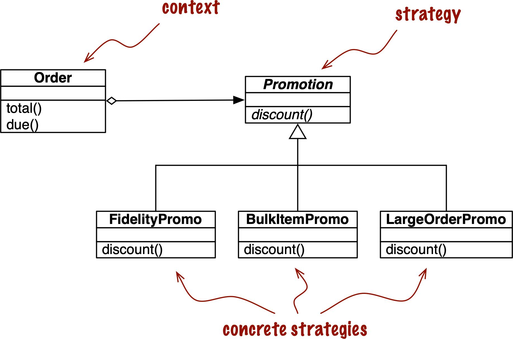
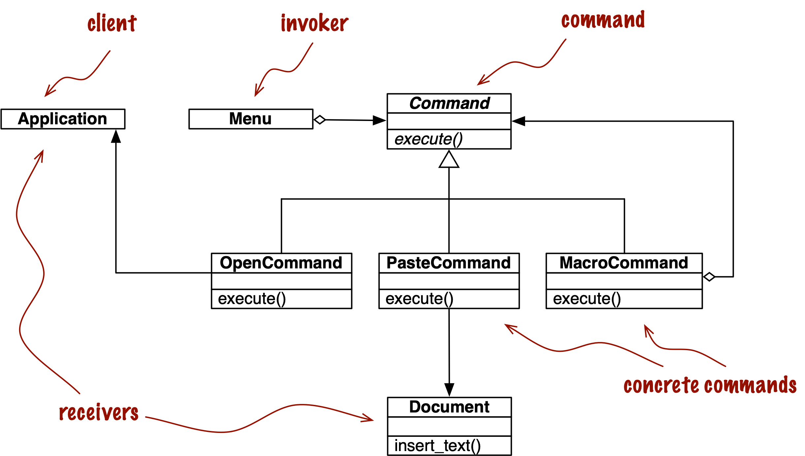

# Design Patterns with First-Class Functions

- In software engineering, a design pattern is a general recipe for solving a common design problem.

- The use of design is popularized by landmark book Design Patterns: Elements of Reusable Object Oriented Software by Gang of Four. Catalog of 23 patterns consisting of arrangements of classes exemplified with code in C++.

- Although designs are language independent, that does not mean every pattern applied to every language, python already implements iterator pattern using generators which don’t need class or anything work.

## Case Study: Refactoring Strategy

Strategy is a good example of a design pattern that can be simpler in Python if you leverage functions as first-class objects. 

### Classic Strategy



Strategy pattern in summarized like this in Designed Patterns:

- Define a family of algorithms, encapsulate each one, and make them interchangeable. Strategy lets the algorithm vary independently from clients that use it.
- Here in an online order, discount be based on any strategy

````python
from abc import ABC, abstractmethod
from collections.abc import Sequence
from decimal import Decimal
from typing import NamedTuple, Optional


class Customer(NamedTuple):
    name: str
    fidelity: int


class LineItem(NamedTuple):
    product: str
    quantity: int
    price: Decimal

    def total(self) -> Decimal:
        return self.price * self.quantity


class Order(NamedTuple):  # the Context
    customer: Customer
    cart: Sequence[LineItem]
    promotion: Optional['Promotion'] = None

    def total(self) -> Decimal:
        totals = (item.total() for item in self.cart)
        return sum(totals, start=Decimal(0))

    def due(self) -> Decimal:
        if self.promotion is None:
            discount = Decimal(0)
        else:
            discount = self.promotion.discount(self)
        return self.total() - discount

    def __repr__(self):
        return f'<Order total: {self.total():.2f} due: {self.due():.2f}>'


class Promotion(ABC):  # the Strategy: an abstract base class
    @abstractmethod
    def discount(self, order: Order) -> Decimal:
        """Return discount as a positive dollar amount"""


class FidelityPromo(Promotion):  # first Concrete Strategy
    """5% discount for customers with 1000 or more fidelity points"""

    def discount(self, order: Order) -> Decimal:
        rate = Decimal('0.05')
        if order.customer.fidelity >= 1000:
            return order.total() * rate
        return Decimal(0)


class BulkItemPromo(Promotion):  # second Concrete Strategy
    """10% discount for each LineItem with 20 or more units"""

    def discount(self, order: Order) -> Decimal:
        discount = Decimal(0)
        for item in order.cart:
            if item.quantity >= 20:
                discount += item.total() * Decimal('0.1')
        return discount


class LargeOrderPromo(Promotion):  # third Concrete Strategy
    """7% discount for orders with 10 or more distinct items"""

    def discount(self, order: Order) -> Decimal:
        distinct_items = {item.product for item in order.cart}
        if len(distinct_items) >= 10:
            return order.total() * Decimal('0.07')
        return Decimal(0)
````

- Notice how strategy instances are more like single method, as they have no attributes

````python
from collections.abc import Sequence
from dataclasses import dataclass
from decimal import Decimal
from typing import Optional, Callable, NamedTuple


class Customer(NamedTuple):
    name: str
    fidelity: int


class LineItem(NamedTuple):
    product: str
    quantity: int
    price: Decimal

    def total(self):
        return self.price * self.quantity

@dataclass(frozen=True)
class Order:  # the Context
    customer: Customer
    cart: Sequence[LineItem]
    promotion: Optional[Callable[['Order'], Decimal]] = None # typehints for callable

    def total(self) -> Decimal:
        totals = (item.total() for item in self.cart)
        return sum(totals, start=Decimal(0))

    def due(self) -> Decimal:
        if self.promotion is None:
            discount = Decimal(0)
        else:
            discount = self.promotion(self)
        return self.total() - discount

    def __repr__(self):
        return f'<Order total: {self.total():.2f} due: {self.due():.2f}>'

def fidelity_promo(order: Order) -> Decimal:
    """5% discount for customers with 1000 or more fidelity points"""
    if order.customer.fidelity >= 1000:
        return order.total() * Decimal('0.05')
    return Decimal(0)


def bulk_item_promo(order: Order) -> Decimal:
    """10% discount for each LineItem with 20 or more units"""
    discount = Decimal(0)
    for item in order.cart:
        if item.quantity >= 20:
            discount += item.total() * Decimal('0.1')
    return discount


def large_order_promo(order: Order) -> Decimal:
    """7% discount for orders with 10 or more distinct items"""
    distinct_items = {item.product for item in order.cart}
    if len(distinct_items) >= 10:
        return order.total() * Decimal('0.07')
    return Decimal(0)
````

### Choosing the Best Strategy: Simple Approach

Assume scenario where your best_promo finds you maximum discount you can avail.

````python
Order(joe, long_cart, best_promo)
````

````python
promos = [fidelity_promo, bulk_item_promo, large_order_promo]


def best_promo(order: Order) -> Decimal:
    """Compute the best discount available"""
    return max(promo(order) for promo in promos)
````

- Now to add a new promotion strategy, we must make sure to add it to this list to avail discount correctly. 

### Finding Strategies in a Module

Modules in Python are also first-class objects, and the standard library provides several functions to handle them.

- `globals()` : Returns a dictionary representing the current global symbol table. This is always the dictionary of the current module (inside a function or method, this is the module where it is defined, not the module from its called)

````python
from decimal import Decimal
from strategy import Order
from strategy import (
    fidelity_promo, bulk_item_promo, large_order_promo
)

promos = [promo for name, promo in globals().items()
                if name.endswith('_promo') and
                   name != 'best_promo'
]


def best_promo(order: Order) -> Decimal:
    """Compute the best discount available"""
    return max(promo(order) for promo in promos)
````

Another way of collecting the available promotions would be to create a  module and put all the  strategy functions there, except for `best_promo`.

```python
from decimal import Decimal
import inspect

from strategy import Order
import promotions


promos = [func for _, func in inspect.getmembers(promotions, inspect.isfunction)]


def best_promo(order: Order) -> Decimal:
    """Compute the best discount available"""
    return max(promo(order) for promo in promos)
```

## Decorator-Enhanced Strategy Pattern

- we had problem where each strategy need to be added in `best_promo` function to actually be used or else it will be a subtle bug.
- we can use Registration decorators to avoid these issues.

````python
Promotion = Callable[[Order], Decimal]

promos: list[Promotion] = []


def promotion(promo: Promotion) -> Promotion:
    promos.append(promo)
    return promo


def best_promo(order: Order) -> Decimal:
    """Compute the best discount available"""
    return max(promo(order) for promo in promos)


@promotion
def fidelity(order: Order) -> Decimal:
    """5% discount for customers with 1000 or more fidelity points"""
    if order.customer.fidelity >= 1000:
        return order.total() * Decimal('0.05')
    return Decimal(0)


@promotion
def bulk_item(order: Order) -> Decimal:
    """10% discount for each LineItem with 20 or more units"""
    discount = Decimal(0)
    for item in order.cart:
        if item.quantity >= 20:
            discount += item.total() * Decimal('0.1')
    return discount


@promotion
def large_order(order: Order) -> Decimal:
    """7% discount for orders with 10 or more distinct items"""
    distinct_items = {item.product for item in order.cart}
    if len(distinct_items) >= 10:
        return order.total() * Decimal('0.07')
    return Decimal(0)
````

## The Command Pattern



The goal of Command is to decouple an object that invokes an operation  (the invoker) from the provider object that implements it (the  receiver). In the example from *Design Patterns*, each invoker is a menu item in a graphical application, and the receivers are the  document being edited or the application itself.

The idea is to put a `Command` object between the two, implementing an interface with a single method, `execute`, which calls some method in the receiver to perform the desired operation.

That way the invoker does not need to know the interface of the  receiver, and different receivers can be adapted through different `Command` subclasses.

Instead of giving the invoker a `Command` instance, we can simply give it a function. Instead of calling `command.execute()`, the invoker can just call `command()`. The `MacroCommand` can be implemented with a class implementing `__call__`.