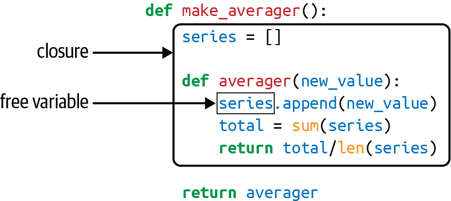

# Decorators and Closures

Function decorators let us `mark` functions in the source code tto enhance their behaviour in some way.

The most obscure reserved keyword in Python is `nonlocal`, introduced in Python 3.0. You can have a profitable life as a Python programmer without ever using it if you adhere to a strict regimen of class-centered object orientation. However, if you want to implement your own function decorators, you must understand closures, and then the need for `nonlocal` becomes obvious.

## Decorators 101

A decorator is a callable that takes another function as an argument (the decorated function)

````python
@decorate
def target():
  print('running target')
````

Its similar to

````python
def target():
  print('running target')
target = decorate(target)	# note how its bound to same function name
````

Another example to prove above point how we modify the function.

````python
def deco(func):
  def inner():
    print('running inner')
  return inner

@deco
def target():
  print('running target')
  
target()
# running inner
````

Strictly speaking, decorators are just syntactic sugar.

Three essential facts make a good summary of decorators:

- A decorator is a function or another callable.
- A decorator may replace the decorated function with a different one.
- Decorators are executed immediately when a module is loaded.

## When Python Executes Decorators

A key features of decorators is that they run right after the decorated function is defined. That is usually at import time.

````python
registry = []

def register(func):
    print(f'Registering function: {func.__name__}')
    registry.append(func)
    return func

@register
def f1():
    print('Running f1()')

@register
def f2():
    print('Running f2()')

def f3():
    print('Running f3()')

def main():
    print('Running main()')
    print('Registry:', registry)
    f1()
    f2()
    f3()

if __name__ == '__main__':
    main()
````

Output of above program

````python
running register(<function f1 at 0x100631bf8>)
running register(<function f2 at 0x100631c80>)
running main()
registry -> [<function f1 at 0x100631bf8>, <function f2 at 0x100631c80>]
running f1()
running f2()
running f3()
````

## Registration Decorators

There are two ways decorators are used in real-code

- The decorator function is defined in the same module as the decorated functions. A real decorator is usually defined in one module and  applied to functions in other modules.
- The `register` decorator returns the same function passed as an argument. In practice, most decorators define an inner function and return it.

## Variable Scope Rules

we define and test a function that reads two variables: a local variable `a`—defined as function parameter—and variable `b` that is not defined anywhere in the function.

````python
def f1(a):
  print(a)
  print(b)	# not defined error
````

Interesting example

````python
b = 6
def f1(a):
  print(a)
  print(b)
  b = 9
# this raises different error, UnboundLocalError, b referenced before assignment
````

- Awkward behaviour of above function is due to Python compiling body of the function first and deciding that `b` is a local variable.
- This is not a bug, but a design choice

f we want the interpreter to treat `b` as a global variable and still assign a new value to it within the function, we use the `global` declaration:

````python
b = 6
def f1(a):
  global b
  print(a)
  print(b)
  b = 9
````

We see two scopes in action :

- The module global scope
  - Made of names assigned to values outside of any class or function block.
- The f3 function local scope
  - Made of names assigned to values as parameters, or directly in the body of the function.

There is one other scope where variables can come from, which we call *nonlocal* and is fundamental for closures

## Closures

In the blogosphere, closures are sometimes confused with anonymous functions. Many confuse them because of the parallel history of those features: defining functions inside functions is not so common or convenient, until you have anonymous functions. And closures only matter when you have nested functions.

- a closure is a function—let’s call it `f`—with an extended scope that encompasses variables referenced in the body of `f` that are not global variables or local variables of `f`. Such variables must come from the local scope of an outer function that encompasses `f`.

It does not matter whether the function is anonymous or not; what matters is that it can access nonglobal variables that are defined outside of its body.

Consider an `avg` function to compute the mean of ever-growing series of values.

````python
avg(10)	# 10
avg(11) # 10.5
avg(12) # 11
````

NOTE: how average function seems to have memory, let’s implement using a class.

````python
class Averager():

    def __init__(self):
        self.series = []

    def __call__(self, new_value):
        self.series.append(new_value)
        total = sum(self.series)
        return total / len(self.series)
````

````python
avg = Average()
avg(10)
avg(11)
avg(12)
````

We can emulate similar behaviour using high-order functions

````python
def make_averager():
    series = []

    def averager(new_value):
        series.append(new_value)
        total = sum(series)
        return total / len(series)

    return averager
````

````python
avg = make_average()
avg(10)
avg(11)
avg(12)
````

- How does the make_averager keep track of the history ?
- `series` is a local variable of make_averager, because its assigned inside body of it. its local scope should be gone with each call but it somehow persists.
- Within `make_average`, we call `series` is a *free variable*. This is a technical term meaning its not bound in the local scope anymore.



We can inspect by using following commands

````python
>>> avg.__code__.co_varnames
('new_value', 'total')
>>> avg.__code__.co_freevars
('series',)
````

## The nonlocal Declaration

Our previous `make_averager` was not efficient. We stored all values in the historical series and computed their `sum` every time averager was called. Let’s implement much better version

````python
def make_averager():
  cnt = 0
  total = 0
  
  def averager(new_value):
    cnt += 1
    total += new_value
    return total/cnt
  return averager
````

```python
# when executed you get : UnboundLocalError: local variable 'count' referenced before assignment
```

- wait why ? because statement `count += 1` actually means the same as `count = count+1` when `count` is a number or any immutable type. So we are actually assigning to `count` in the body of averager, and that makes its scope local.
- This worked fine with our mutable list, and we only used `append` and `len` method, but how to deal with immutable types ? (newly created always)
- To work around this we use `nonlocal` keyword

````python
def make_averager():
  cnt = 0
  total = 0
  
  def averager(new_value):
    nonlocal count, total
    cnt += 1
    total += new_value
    return total/cnt
  return averager
````

When a function is defined, the Python bytecode compiler determines how to fetch a variable `x` that appears in it, based on these rules:

- If there is a `global x` declaration, `x` comes from and is assigned to the `x` global variable module.
- If there is a `nonlocal x` declaration, `x` comes from and is assigned to the `x` local variable of the nearest surrounding function where `x` is defined.
- If `x` is a parameter or is assigned a value in the function body, then `x` is the local  variable.
- If `x` is referenced but is not assigned and is not a parameter:
  - `x` will be looked up in the local scopes of the surrounding function bodies (nonlocal scopes).
  - If not found in surrounding scopes, it will be read from the module global scope.
  - If not found in the global scope, it will be read from `__builtins__.__dict__`.

## Implementing a Simple Decorators

````python
import time

def clock(func):
  def clocked(*args):
    t0 = time.perf_counter()
    result = func(*args)
    elapsed = time.perf_counter()-t0
    name = func.__name__
    arg_str = ','.join(repr(arg) for arg in args)
    print(f"[{elapsed:0.8f}s] {name}({arg_str}) -> {result!r}")
    return result
  return clocked
````

````python
@clock
def factorial(n):
    return 1 if n < 2 else n*factorial(n-1)
  
# internally : factorial = clock(factorial)
# even if you do __name__ for it, output will be `clocked`
````

A more improved clocker that supports keyword arguments and doesn’t mask original functions `__doc__`, `__name__`

````python
import time
import functools


def clock(func):
    @functools.wraps(func)
    def clocked(*args, **kwargs):
        t0 = time.perf_counter()
        result = func(*args, **kwargs)
        elapsed = time.perf_counter() - t0
        name = func.__name__
        arg_lst = [repr(arg) for arg in args]
        arg_lst.extend(f'{k}={v!r}' for k, v in kwargs.items())
        arg_str = ', '.join(arg_lst)
        print(f'[{elapsed:0.8f}s] {name}({arg_str}) -> {result!r}')
        return result
    return clocked
````

## Decorators in Standard Library

### Memoization with functools.cache

- The `functools.cache` decorator implements `memoization`

````python
from clockdeco import clock
import functools

@functools.cache
@clock
def fib(n):
  if n < 2:
    return n
  return fib(n-1) + fib(n-2)
````

````python
# NOTE:
@alpha
@beta
def my_func():
  ...
  
# above syntax resolves to : my_func = alpha(beta(my_func))
````

`functools.cache` can consume all available memory if there is a very large number of cache entries. Consider it more suitable for use in short-lived command-line scripts. In long-running processes, It is recommended using `functools.lru_cache` with a suitable `maxsize` parameter, as explained in the next section.

### Using lru_cache

The `functools.cache` decorator is actually a simple wrapper around the older `functools.lru_cache` function, which is more flexible and compatible with Python 3.8 and earlier versions.

The main advantage of `@lru_cache` is that its memory usage is bounded by the  `maxsize` parameter, which has a rather conservative default value of 128—which means the cache will hold at most 128 entries at any time.

````python
@lru_cache
def my_costly_func(a,b):
  ...
````

- Accepts two params
  - `maxsize=128` : maximum entries in lru
  - `typed=False` : determines whether to store different arg types separately.

### Single Dispatch Generic Functions

Consider this function to htmlize a python obj, but it depends on `repr` of object which may not be useful for all objects.

````python
import html

def htmlize(obj):
    content = html.escape(repr(obj))
    return f'<pre>{content}</pre>'
````

- since we don’t have method overloading in python, we can create either variation of the `htmlize` with different name suffixed/prefixed with its type or we can use long `if/elif/..` or `match/case/..`
- so alternative way to do this is to use singledispatch and then register our overloading function on top of it.

````python
from functools import singledispatch
from collections import abc
import fractions
import decimal
import html
import numbers

@singledispatch
def htmlize(obj: object) -> str:
    content = html.escape(repr(obj))
    return f'<pre>{content}</pre>'

@htmlize.register
def _(text: str) -> str:
    content = html.escape(text).replace('\n', '<br/>\n')
    return f'<p>{content}</p>'

@htmlize.register
def _(seq: abc.Sequence) -> str:
    inner = '</li>\n<li>'.join(htmlize(item) for item in seq)
    return '<ul>\n<li>' + inner + '</li>\n</ul>'

@htmlize.register
def _(n: numbers.Integral) -> str:
    return f'<pre>{n} (0x{n:x})</pre>'

@htmlize.register
def _(n: bool) -> str:
    return f'<pre>{n}</pre>'

@htmlize.register(fractions.Fraction)
def _(x) -> str:
    frac = fractions.Fraction(x)
    return f'<pre>{frac.numerator}/{frac.denominator}</pre>'

@htmlize.register(decimal.Decimal)
@htmlize.register(float)
def _(x) -> str:
    frac = fractions.Fraction(x).limit_denominator()
    return f'<pre>{x} ({frac.numerator}/{frac.denominator})</pre>'
````

## Parameterized Decorators

- when parsing a decorator source code, python takes decorated function and passes it as the first argument to decorator functions.
- we use decorator factory that takes arguments and return decorator which is then applied to the function

````python
registry = set()

def register(active=True):
  def decorate(func):
    print('running register'f'(active={active})->decorate({func})')
   	if active:
      registry.add(func)
    else:
      registry.discard(func)
    return func
  return decorate

@register(active=False)
def f1():
  print('running f1()')
  
@register()
def f2():
  print('running f2()')

def f3()
	print('running f3()')
  
# Output
# running register(active=False)->decorate(<function f1 at 0x10063c1e0>)
# running register(active=True)->decorate(<function f2 at 0x10063c268>)
# >>> registration_param.registry
# [<function f2 at 0x10063c268>]
````

