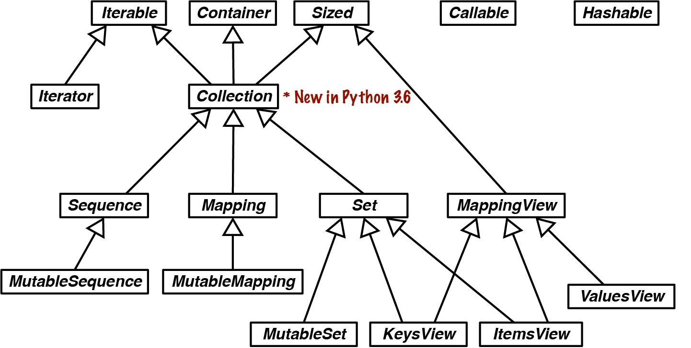

# Interfaces, Protocols and ABCs

*Program to an interface, not an implementation*. First principle of Object-Oriented Design.

Depending on the programming language, we have one or more ways of defining and using interfaces.

1. Duck Typing : python’s default approach from beginning
2. Goose Typing : approach supported by ABCs since python2.6, relies on runtime checks of objects against ABCs
3. Static Typing: traditional approch of statically-typed language like C and Java, supported since Python3.5 by `typing` module and enforced by external type checkers compliant with PEP484
4. Static Duck Typing: An approach made popular by `Go` language, supported by subclasses of `typing.Protocol` new in python 3.8, enforce by external type checkers.

## The Typing Map


Each of these four approaches rely on interfaces to work, but static typing can be done—poorly—using only concrete types instead of interface abstractions like protocols and abstract base classes.

## Two Kinds of Protocols

The word `protocol` has different meanings in computer science.

- A network protocol specifies commands that a client can send to server, `GET`, `POST`, and `HEAD`.

An object protocol specifies methods which an object must provide to fulfill a role. sequence protocol : methods which allow python object to behave as a sequences.

Implementing protocol requires bunch of methods but we can go by implementing few of them. Implementing `__getitem__` is enough to retrieve items by index, and support iteration and the `in` operator.

Protocol is a *informal interface*

earlier most of documentation refer to these as protocols (<3.8) but after PEP 544, Static Protocols allows us to create subclasses of `typing.Protocol` to define one or more methods that a class must implement (or inherit) to satisfy a static type checker.

- Dynamic Protocol : Informal protocols python always had
- Static Protocols : protocols defined by PEP 544 standard.

## Programming Ducks

### Python Digs Sequences

philosophy of Python Data Model is to cooperate with essential dynamic protocols as much as possible. When it comes to sequences, python tries hard to work with even simplest implementation.


- Note: How sequence interface is formalized as an ABC. NOTE: python interpretor and built-ins like `list` , `str` do not rely on ABC at all.

- Most ABCs in the `collections.abc` module exist to formalize interfaces that are implemented by built-in objects and are implicitly supported by the interpreter—both of which predate the ABCs themselves. The ABCs are useful as starting points for new classes, and to support explicit type checking at runtime (a.k.a. *goose typing*) as well as type hints for static type checkers.

`Vowels` class didn’t have any `__iter__` method and neither it inherited `abc.Sequence` and only implemented `__getitem__` but still it was iterable because of python fallback to `__getitem__` method for iteration. `in` method also works without any implementations of `__contains__`.

### Monkey Patching : Implementing a Protocol at Runtime

Monkey patching is dynamically changing a module, class or function at runtime to add feature or fix bugs. For e.g. the gevent library monkey patches parts of Python’s standard library to allow lightweight concurrency without threads or `async`/`await`

````python
# from our deck example there is no shuffle method

# we need something like this :
from random import shuffle
l = list(range(10))
shuffle(l)
l	@ [1, 3, 4, 9, 7, 8, 2, 5, 6]

# but if we try to shuffle FrenchDeck class it fails
shuffle(deck)
FrenchDeck' object does not support item assignment
````

Mutable sequences must also provide a `__setitem__` method.

````python
def set_card(deck, position, card):			# self, key, value
  deck._cards[position] = card
FrenchDeck.__setitem__ = set_card		# monkey patching
shuffle(deck)
# works
````

Monkey patching is powerful, but the code that does the actual patching is very tightly coupled with the program to be patched, often handling private and undocumented attributes.

Besides being an example of monkey patching, Example 13-4 highlights the dynamic nature of protocols in dynamic duck typing: random.shuffle doesn’t care about the class of the argument, it only needs the object to implement methods from the mutable sequence protocol. It doesn’t even matter if the object was “born” with the necessary methods or if they were somehow acquired later.

### Defensive Programming and Fail Fast

Defensive programming is like defensive driving: a set of practices to enhance safety even when faced with careless programmers—or drivers.

Many bugs cannot be caught except at runtime—even in mainstream statically typed languages. In a dynamically typed language, “fail fast” is excellent advice for safer and easier-to-maintain programs. 

Failing fast means raising runtime errors as soon as possible, for example, rejecting invalid arguments right a the beginning of a function body.

````python
    def __init__(self, iterable):
        self._balls = list(iterable)

# here no need to check if iterable is list or not, immidiatedly build a list out of it
# not it might be bad if data shouldn't be copied (large data). In that case use isinstance(x, abc.MutableSequence)
````

If you are afraid to get an infinite generator—not a common issue—you can begin by calling `len()` on the argument. This would reject iterators, while safely dealing with tuples, arrays, and other existing or future classes that fully implement the `Sequence` interface. Calling `len()` is usually very cheap, and an invalid argument will raise an error immediately.

- Defensive code leveraging duck types can also include logic to handle different types without using `isinstance()` or `hasattr()` tests.

````python
# Duck typing to handle a string or an iterable of strings
		try:
        field_names = field_names.replace(',', ' ').split()
    except AttributeError:
        pass
    field_names = tuple(field_names)
    if not all(s.isidentifier() for s in field_names):
        raise ValueError('field_names must all be valid identifiers')
````

- sometimes duck typing is more expressive than static type hints

````python
    def namedtuple(
        typename: str,
        field_names: Union[str, Iterable[str]],		# duck typing is more expressive for this
        *,
        # rest of signature omitted
````

## Goose Typing

*An abstract class represents an interface.* -Bjarne Stroustrup, creator of C++.

Python doesn’t have an `interface` keyword. We use abstract base classes (ABCs) to define interfaces for explicit type checking at runtime - also supported by static type checkers.

Abstract base classes complement duck typing by providing a way to define interfaces when other techniques like `hasattr()` would be clumsy or subtly wrong (for example, with magic methods). ABCs introduce virtual subclasses, which are classes that don’t inherit from a class but are still recognized by `isinstance()` and `issubclass()`; see the `abc` module documentation.

### Waterfowl and ABCs - An Essay by Alex Martelli

In Python, this mostly boils down to avoiding the use of `isinstance` to check obejct’s type, not to mention worst way of checking `type(foo) is bar`.

The overall *duck typing* approach remains quite useful in many contexts - yet it many other and often preferable one has evolved over time.

````python
class Artist:
    def draw(self): ...

class Gunslinger:
    def draw(self): ...

class Lottery:
    def draw(self): ...
````

- mere existence of a method named draw, called without args, ensures x.draw() and y.draw() can be called, and any way exchangeable or abstractly equivalent - nothing about the simlarity of semantics resulting from such calls can be inferred.

- Rather, we need a knowledgeable programmer to somehow positively *assert* that such an equivalence holds at some level!
- In biology (and other disciplines), this issue has led to the emergence  (and, on many facets, the dominance) of an approach that’s an  alternative to phenetics, known as *cladistics*—focusing taxonomical choices on characteristics that are inherited from common  ancestors, rather than ones that are independently evolved.
- For example, sheldgeese (once classified as being closer to other geese) and shelducks (once classified as being closer to other ducks) are now  grouped together within  the subfamily Tadornidae (implying they’re closer to each other than to any other Anatidae, as they share a closer common ancestor)
- What *goose typing* means is: `isinstance(obj, cls)` is now just fine…as long as `cls` is an abstract base class—in other words, `cls`’s metaclass is `abc.ABCMeta`.
- Among the many conceptual advantages of ABCs over concrete classes (e.g., Scott Meyer’s “all non-leaf classes should be abstract”; see Item 33 in his book, More Effective C++, Addison-Wesley), Python’s ABCs add one major practical advantage: the register class method, which lets end-user code “declare” that a certain class becomes a “virtual” subclass of an ABC (for this purpose, the registered class must meet the ABC’s method name and signature requirements, and more importantly, the underlying semantic contract—but it need not have been developed with any awareness of the ABC, and in particular need not inherit from it!).
- Sometimes you don’t even need to register a class for an ABC to recognize it as a  subclass!

````python
class Struggle:
  def __len__(self): return 23

from collections import abc
isinstance(Struggle(), abc.Sized)	# true
````

- `abc.Sized` recorgnizes `Struggle` as a ‘subclass’, with no need for registration, as implemnenting special method `__len__` is all required.

- So, here’s my valediction: whenever you’re implementing a class embodying any of the concepts represented in the ABCs in `numbers`, `collections.abc`, or other framework you may be using, be sure (if needed) to subclass it from, or register it into, the corresponding ABC. At the start of your  programs using some library or framework defining classes which have  omitted to do that, perform the registrations yourself; then, when you  must check for (most typically) an argument being, e.g, “a sequence,”  check whether:

  ```
  isinstance(the_arg, collections.abc.Sequence)
  ```

- And, *don’t* define custom ABCs (or metaclasses) in production code. If you feel the urge to do so, I’d bet it’s likely to be a case  of the “all problems look like a nail”–syndrome for somebody who just  got a shiny new hammer—you (and future maintainers of your code) will be much happier sticking with straightforward and simple code, eschewing such depths. *Valē!*

- To summarize, *goose typing* entails:

    - Subclassing from ABCs to make it explict that you are implementing a previously defined interface.
    - Runtime type checking using ABCs instead of concrete classes as the second argument for `isinstance` and `issubclass`.

- If `isinstance` and `issubclass` is used with concrete classes, type checks limit polymorphism—an essential feature of object-oriented programming.

- However, even with ABCs, you should beware that excessive use of `isinstance` checks may be a *code smell*—a symptom of bad OO design.

- On the other hand, it’s OK to perform an `isinstance` check against an ABC if you must enforce an API contract: “Dude, you have to implement this if you want to call me,” as technical reviewer Lennart Regebro put it. That’s particularly useful in systems that have a plug-in architecture.

### Subclassing an ABC

````python
from collections import namedtuple, abc

Card = namedtuple('Card', ['rank', 'suit'])

class FrenchDeck2(abc.MutableSequence):
    ranks = [str(n) for n in range(2, 11)] + list('JQKA')
    suits = 'spades diamonds clubs hearts'.split()

    def __init__(self):
        self._cards = [Card(rank, suit) for suit in self.suits
                                        for rank in self.ranks]

    def __len__(self):
        return len(self._cards)

    def __getitem__(self, position):
        return self._cards[position]

    def __setitem__(self, position, value):	# for enabling shuffling
        self._cards[position] = value

    def __delitem__(self, position):	# mutable sequence interface forces to implement this.
        del self._cards[position]

    def insert(self, position, value): # its third import abstract method of MutableSequence
        self._cards.insert(position, value)
````


### ABCs in the Standard Library

Since Python 2.6, the standard library provides several ABCs. Most are defined in the `collections.abc` module, but there are others. You can find ABCs in the `io` and `numbers` packages, for example. But the most widely used are in `collections.abc`.



### Defining and Using an ABC

This warning appeared in the “Interfaces” chapter of the first edition of *Fluent Python*:

> ABCs, like descriptors and metaclasses, are tools for building frameworks. Therefore, only a small minority of Python developers can create ABCs without imposing unreasonable limitations and needless work on fellow programmers.

To justify creating an ABC, we need to come up with a context for using it as an extension point in a framework. So here is our context:

Imagine you need to display advertisements on a website or a mobile app in random order, but without repeating an ad before the full inventory of ads is shown. Now let’s assume we are building an ad management framework called `ADAM`. One of its requirements is to support **user-provided nonrepeating random-picking classes**.

The ABC will be named `Tombola`, after the Italian name of bingo and the tumbling container that mixes the numbers. It could be used anywhere Bingo Cages, Lottery Blowers machines etc. It will have 4 methods

Abstract Methods

- `.load()` : put items in container
- `.pick()` : remove one item at random from container, return it

Concrete Methods

- `loaded()` : returns True, if there is at least on item in container
- `.inspect()` returns tuple build from items currently in container, without changing its content

````python
import abc

class Tombola(abc.ABC):# subclass ABC

    @abc.abstractmethod
    def load(self, iterable): # abstract method
        """Add items from an iterable."""

    @abc.abstractmethod
    def pick(self): # docstring instructing implementers to raise LookupError
        """Remove item at random, returning it.

        This method should raise `LookupError` when the instance is empty.
        """

    def loaded(self): # abc's may include concrete methods
        """Return `True` if there's at least 1 item, `False` otherwise."""
        return bool(self.inspect())	# we don't how to check if class will implement bool or not, but we know inspect will give us the items

    def inspect(self):
        """Return a sorted tuple with the items currently inside."""
        items = []
        while True:	# we don't know implementation detail of storage scheme but we can repetedily `.pick` to get all items
            try:
                items.append(self.pick())
            except LookupError:
                break
        self.load(items) # put back all items back to the container
        return tuple(items)
````

- Being aware of their internal data structures, concrete subclasses of `Tombola` may always override `.inspect()` with a smarter implementation, but they don’t have to.

### ABC Syntax Details

````python
class MyABC(abc.ABC):
    @classmethod
    @abc.abstractmethod
    def an_abstract_classmethod(cls, ...):
        pass
````

- NOTE: @abstractclassmethod and @abstractstaticmmethod were removed in python 3.3
- The order of stacked function decorators matters

### Subclassing an ABC

````python
import random

from tombola import Tombola


class BingoCage(Tombola): # extends Tombola

    def __init__(self, items):
        self._randomizer = random.SystemRandom()
        self._items = []
        self.load(items)

    def load(self, items):
        self._items.extend(items)
        self._randomizer.shuffle(self._items)

    def pick(self):
        try:
            return self._items.pop()
        except IndexError:
            raise LookupError('pick from empty BingoCage')

    def __call__(self):
        self.pick()
````

### A Virtual Subclass of ABC

An essential characteristic of goose typing—and one reason why it deserves a waterfowl name—is the ability to register a class as a *virtual subclass* of an ABC, even if it does not inherit from it. When doing so, we promise that the class faithfully implements the interface defined in the ABC—and Python will believe us without checking. If we lie, we’ll be caught by the usual runtime exceptions.

This is done by calling a `register` class method on the ABC. The registered class then becomes a virtual subclass of the ABC, and will be recognized as such by `issubclass`, but it does not inherit any methods or attributes from the ABC.

````python
from random import randrange

from tombola import Tombola

@Tombola.register # register method in ABC
class TomboList(list): # this class becomes virtual subclass of ABC

    def pick(self):
        if self:
            position = randrange(len(self))
            return self.pop(position)  4
        else:
            raise LookupError('pop from empty TomboList')

    load = list.extend

    def loaded(self):
        return bool(self)

    def inspect(self):
        return tuple(self)
      
# Tombola.register(TomboList)	# we can register using this syntax also, if we don't maintain the class we want to register
````

- Note that because of the registration, the functions `issubclass` and `isinstance` act as if `TomboList` is a subclass of `Tombola`

- However, inheritance is guided by a special class attribute named `__mro__`—the Method Resolution Order. It basically lists the class and its superclasses in the order Python uses to search for methods. If you inspect the `__mro__` of `TomboList`, you’ll see that it lists only the “real” superclasses—`list` and `object`:
- `Tombola` is not in `Tombolist.__mro__`, so `Tombolist` does not inherit any methods from `Tombola`.

## Structural Typing with ABCs

- ABCs are mostly used with nominal typing. When a class `Sub` explicitly inherits from `AnABC`, or is registered with `AnABC`, the name of `AnABC` is linked to the `Sub` class—and that’s how at runtime, `issubclass(AnABC, Sub)` returns `True`.
- In contrast, structural typing is about looking at the structure of an object’s public interface to determine its type: an object is consistent-with a type if it implements the methods defined in the type. Dynamic and static duck typing are two approaches to structural typing.

````python
class Struggle:
    def __len__(self): return 23

from collections import abc
isinstance(Struggle(), abc.Sized) # True
issubclass(Struggle, abc.Sized) # True
````

- Class `Struggle` is considered a subclass of `abc.Sized` by the `issubclass` function (and, consequently, by `isinstance` as well) because `abc.Sized` implements a special class method named `__subclasshook__`.
- The `__subclasshook__` for `Sized` checks whether the class argument has an attribute named `__len__`. If it does, then it is considered a virtual subclass of `Sized`.

## Static Protocols

### The typed double Function

````python
def double(x):
  return x * 2

double(1.5)	# 3
double('A') # 'AA'
double([10,20,30])	# [10, 20, 30, 10, 20, 30]

from fractions import Fraction
double(Fraction(2, 5)) # Fraction(4,5)
````

- before static protocols were introduced, there was no way to add type hints to `double` without limiting its uses
- thanks to duck typing, `double` works even with types from the future, such as enhanced `Vector` class
- The initial implementation of type hints in Python was a nominal type  system: the name of a type in an annotation had to match the name of the type of the actual arguments—or the name of one of its superclasses.

````python
from typing import TypeVar, Protocol

T = TypeVar('T')

class Reapeatable(Protocol):
  def __mul__(self, T, repeat_count: int) -> T: ... # self is not annotated, assumed to be of type class.
  
RT = TypeVar('RT', bound = Repeatable)->RT:
  
def double(x: RT) -> RT:	# Now type checker can verify x can be multiplied by scalar, return value of same type
  return x * 2
````

### Runtime Checkable Static Protocols

`typing.Protocol` appears in the statick checking area - bottom half of the diagram. However, when defining a `typing.Protocol` subclass, we can use `@runtime_checkable` decorator to make protocol support `isinstance`/`issubclass` checks at runtime. This works because `typing.Protocol` is an ABC, therefore support `__subclasshook__` 

````python
@runtime_checkable
class SupportsComplex(Protocol):
    """An ABC with one abstract method __complex__."""
  	__slots__ = ()
  
  	@abstractmethod
  	def __complex__(self) -> complex:
    		pass
````

- During static type checking, an object will considered consistent-with `SupprotsComplex` protocol if it implements a `__complex__` method that takes only `self` and returns a `complex`
- Thanks to the `@runtime_checkable` class decorator applied to `SupportsComplex`, that protocol can also be used with `isinstance` checks

````python
from typing import SupportsComplex
import numpy as np
c64 = np.complex64(3+4j)
isinstance(c64, complex)	# False
isinstance(c64, SupportsComplex)	# True
c = complex(c64)	# (3+4j)
isinstance(c, SupportsComplex)	# False
complex(c)	# (3+4j)
````

As a result of that last point, if you want to test whether an object `c` is a `complex` or `SupportsComplex`, you can provide a tuple of types as the second argument to  `isinstance`, like this:

````python
isinstance(c, (complex, SupportsComplex))
````

An alternative would be to use the `Complex` ABC, defined in the `numbers` module. The built-in `complex` type and the NumPy `complex64` and `complex128` types are all registered as virtual subclasses of `numbers.Complex`, therefore this works:

````python
import numbers
isinstance(c, numbers.Complex) # True
isinstance(c64, numbers.Complex) # True
````

It was recommended to use the `numbers` ABCs in the first edition of *Fluent Python*, but now that’s no longer good advice, because those ABCs are not recognized by the static type checkers

Very often at runtime, duck typing is the best approach for type checking: instead of calling `isinstance` or `hasattr`, just try the operations you need to do on the object, and handle exceptions as needed. Here is a concrete example.

Example : given an object `o` that I need to use as a complex number, this would be one approach:

````python
# Approach
if isinstance(o, (complex, SupportsComplex)):
    # do something that requires `o` to be convertible to complex
else:
    raise TypeError('o must be convertible to complex')
    
    
# Goose Typing Approach	# use numbers.Complex ABC
if isinstance(o, numbers.Complex):
    # do something with `o`, an instance of `Complex`
else:
    raise TypeError('o must be an instance of Complex')
    
# duck typing, EAFP Principle, Its easier to ask forgiveness than permission
try:
    c = complex(o)
except TypeError as exc:
    raise TypeError('o must be convertible to complex') from exc
````

### Limitations of Runtime Protocol Checks

We’ve seen that type hints are generally ignored at runtime, and this also affects the use of `isinstance` or `issubclass` checks against static protocols.

For example, any class with a `__float__` method is considered—at runtime—a virtual subclass of `SupportsFloat`, even if the `__float__` method does not return a `float`.

### Supporting a Static Protocol

Given that a `complex` number and `Vector2d` instance both consists of a pair of floats, it makes sense to support conversion from `Vector2d` to `complex`

````python
def __complex__(self):
  return complex(self.x, self.y)

@classmethod
def fromcomplex(cls, datum):
	return cls(datum.real, datum.imag)
````

````python
from typing import SupportsComplex, SupportsAbs
from vector2d_v4 import Vector2d

v = Vector2d(3,4)
isinstance(v, SupportsComplex)	# True
isinstance(v, SupportsAbs)	# True
complex(v)	# (3+4j)
abs(v)		# 5
````

### Dynamic a Static Protocol

While studying goose typing, we saw `Tombola` ABC. Here we’ll see how to define a similar interface using a static protocol.

The `Tombola` ABC specifies two methods: `pick` and `load`. We could define a static protocol with these two methods as well, but Go community recommends that single-method protcols make static duck typing more useful and flexible.

The Go standard library has several interface like `Reader`, an interface for I/O that requires just a `read` method. After a while, if you realize a more complete protocol is required, you can combine two or more protcols to define a new one.

````python
from typing import Protocol, runtime_checkable, Any

@runtime_checkable
class RandomPicker(Protocol):
    def pick(self) -> Any: ...
````

````python
import random
from typing import Any, Iterable, TYPE_CHECKING

from randompick import RandomPicker	# its not necessary to import static protocol to define a class implements it

class SimplePicker: # SimplePicker implements RandomPicker but doesn't subclasses, static duck typing in action
    def __init__(self, items: Iterable) -> None:
        self._items = list(items)
        random.shuffle(self._items)

    def pick(self) -> Any:	# Any is default return type
        return self._items.pop()

def test_isinstance() -> None:	# for test cases only, so Mypy knows it
    popper: RandomPicker = SimplePicker([1])
    assert isinstance(popper, RandomPicker)

def test_item_type() -> None:
    items = [1, 2]
    popper = SimplePicker(items)
    item = popper.pick()
    assert item in items
    if TYPE_CHECKING:
        reveal_type(item)
    assert isinstance(item, int)
````

### Best Practices for Protocol Design

- narrow protocols are more useful - often such protocols have single method, rarely more than a couple of methods. [See This](https://martinfowler.com/bliki/RoleInterface.html)
- sometimes protocols are defined near the function that uses it (“client code”) instead of a library, making it easy to create new types to call that function
- Both above practices : narrow protocols and client-code protocols both avoid unecessary tight coupling i.e. Clients should not be forced to depend upon interfaces that they do not use.
- The page Contribution to typeshed recommentds this naming convention for static protocols.
    - Use plain names for protocols that represent a clear concept (e.g., `Iterator`,  `Container`).
    - Use `SupportsX` for protocols that provide callable methods (e.g., `SupportsInt`, `SupportsRead`, `SupportsReadSeek`).
    - Use `HasX` for protocols that have readable and/or writable attributes or getter/setter methods (e.g., `HasItems`, `HasFileno`).
- Another advantage of narrow protocols is that they are easily extendible

### Extending a Protocol

- When practice suggest a protocol with more methods is desired, instead of adding methods to original Protocols, it’s better to derive a new protocol from it.
- In python extending protocols come with caveats

````python
from typing import Protocol, runtime_checkable
from randompick import RandomPicker

@runtime_checkable	# derived Protocol to be runtime checkable
class LoadableRandomPicker(RandomPicker, Protocol):	# Every protocol must explicitly name typing.Protocol as one of its base classes in addition to the protocol we are extending.
    def load(self, Iterable) -> None: ...
````

### The numbers ABCs and Numeric Protocols

- The `numbers` ABCs are fine for runtime type checking, but unsuitale for static typing
- The numeric static protocols `SupportsComplex`, `SupportFloat`, etc. work well for static typing, but are unreliable for runtime type checking when complex numbers are involved.

