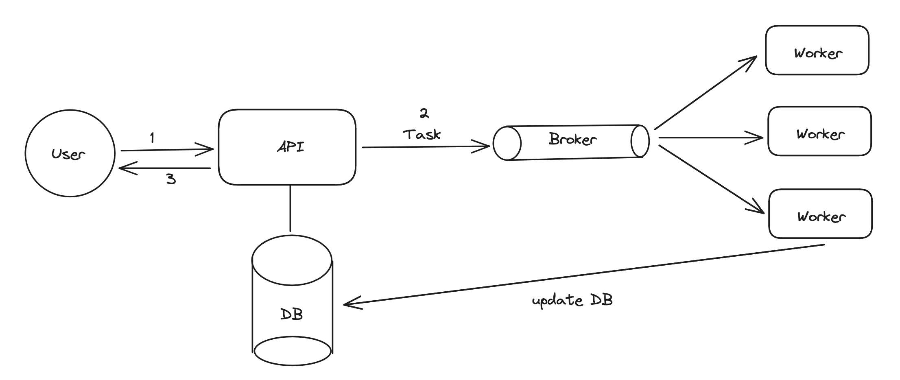
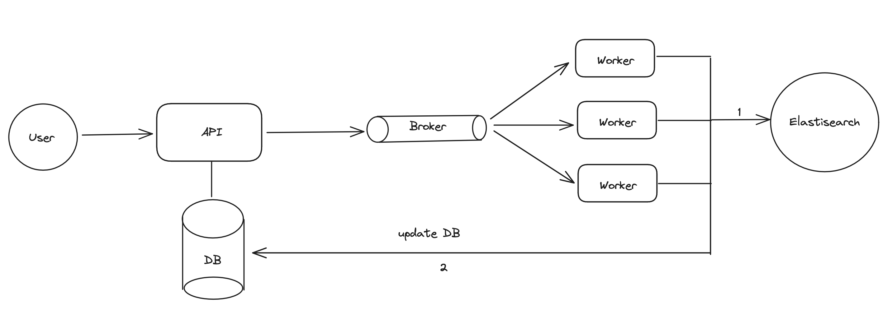
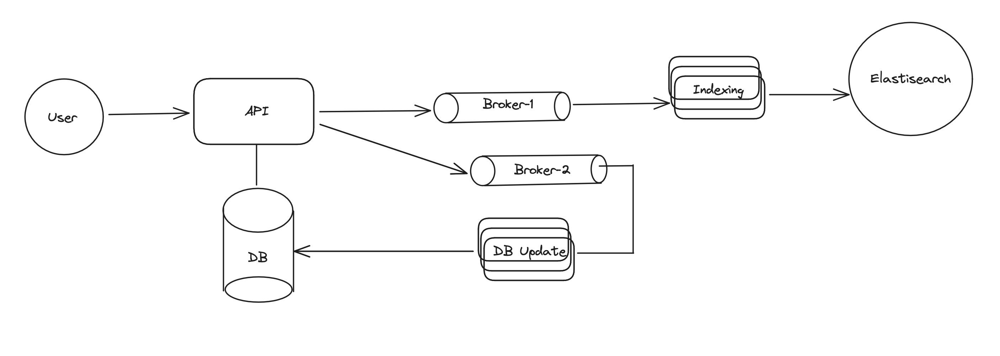
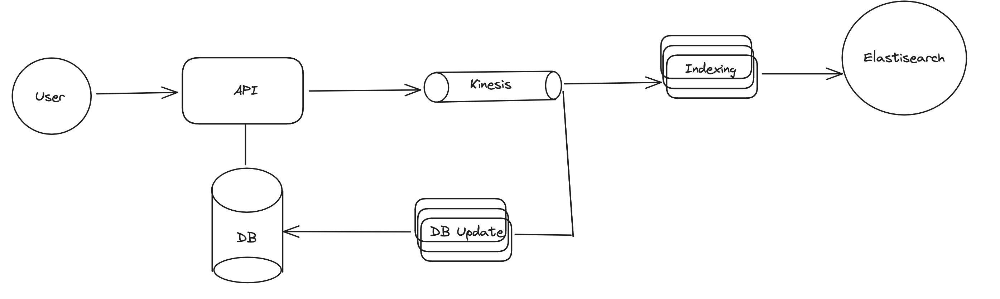

# Messaging and Streaming Systems

## Asynchronous Processing

* user sents the request and immediately recieving response is called as synchronous
* Ex - loading feed, login, payments.
* Asynchronous Systems usually will accept the user payload and forward it to message brokers which will pass this work to workers. User will not wait for response and get back some id to track status of the work, and When workers complete their task, they can just update the DB & status of the task.

## Message Brokers and Queues

Brokers help two services/application communicate through messages. We use message brokers when we want to do something *asynchronous*

* Long Running Tasks
* Trigger Dependent tasks across machines

Features of Message Brokers

* Brokers help us connect different sub-systems
* Brokers acts as a buffer for the messages, allowing consumers to consume messages at their pace. Ex - Notification service
* Brokers can retain messages for `n` days
* Brokers can re-queue the message if not deleted (Visibility Timeout)

## Message Stream and Kafka Essentials

* Ex- assume workers in above example does two things, writes to Elastic Search and to DB

* Approach - 1 : One Message Brokers and add logic in consumers

    * process - 1 & process 2, if either failed then we will not be able process both events correctly

  

* Approach - 2 : Two Brokers & two sets of consumers

    * API server Writes to two brokers and each has its own set of consumers, (solves issue with partial complete writes)
    * Issue - when api server writes to two RabbitMQ, one of them fails, we end up with original problem.

* Solution: write once, but read by many systems - Kafka, Kinesis try to solve this problem.

Message Streams

* Similar to Message Queue except there could be multiple consumers reading from the same stream.

Message Queue vs Message Streams

* In Message Queue, consumers consume a message once while in Kinesis a specific consumer group consumes the message once (usually tracked by checkpoint)

### Kafka Essentials

* Kafka is a message stream that holds the messages. Internally Kafka has topics, with `n` partitions
* Message is sent to a topic, and depending on the configured hash key it is put into a partition.
* Within that partition, messages are ordered (no order guarantee, across partitions) 
* Limitation of Kafka : number of consumer = number of partition
* In Kafka, each consumer can commit their checkpoints. And deletion of messages happens based on the expiry time.

## Realtime Pub/Sub Systems

* Both Message Broker and Streams, requires consumers to `pull` messages out.
* Advantage : Consumers can pull at their own pace, and consumers don’t get overwhelmend
* Disadvantage: Consumption lag when high ingestion.

What if we want low latency  Zero Lag ? --> realtime pubsub

* Instead of consumers pulling the message, the message is pushed to them.
* This way we get really fast delievery time, but can overwhelm the consumers if they are not able to process the message fast (usually we use queue at each consumer)
* Practical Usecase : Message Broadcast, Configuration Push, All systems receive updates without polling for data.

