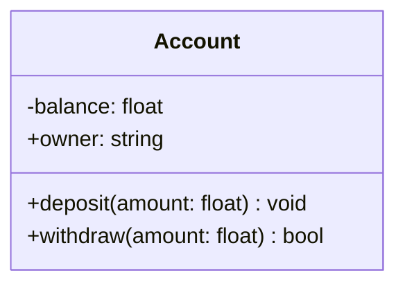
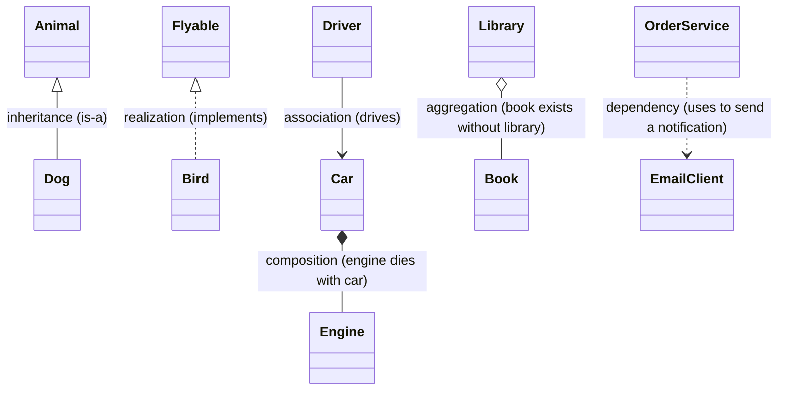
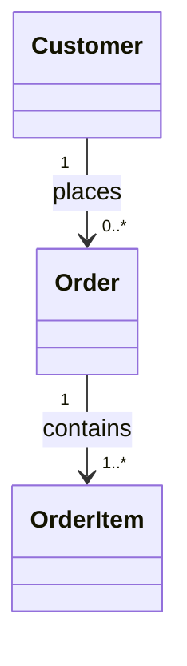
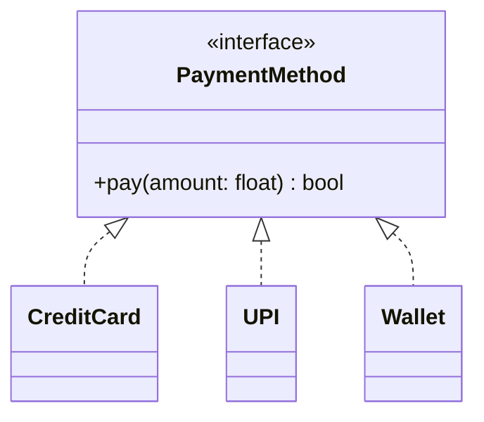
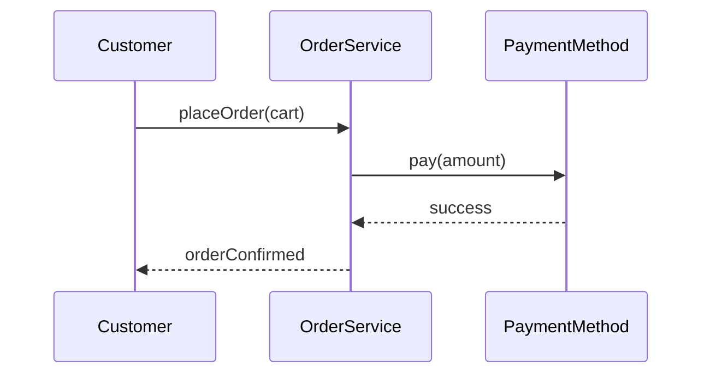

# UML / Class Diagrams

- Mermaid (a markdown-flavoured diagramming syntax) is supported here via `pymdownx.superfences` custom fences -> write a fenced ` ```mermaid ` block and mkdocs-material renders it as an SVG diagram, no separate image needed.
- This note is about *reading/understanding* class diagrams, not drawing tools - the goal is to be able to look at one in an interview/design-doc and instantly know what relationship is being expressed.

## Anatomy of a Class Box

A UML class is drawn as a box split into 3 parts: **name**, **attributes**, **methods**.



- `+` public, `-` private, `#` protected, `~` package/internal
- Underlined member -> static
- *Italic* name / `<<interface>>` / `<<abstract>>` stereotypes -> abstract class or interface

## Relationships (the part that actually matters)

These are what you need to instantly recognize - they map directly to "has-a" vs "is-a" design decisions.

| Relationship | Meaning | Lifecycle coupling | Arrow |
|---|---|---|---|
| Inheritance / Generalization | `is-a` | child depends on parent's existence as a type | hollow triangle, solid line `--|>` |
| Realization / Implementation | `implements` (interface) | same as above but for interfaces | hollow triangle, dashed line `..|>` |
| Composition | strong `has-a`, owns the part | part dies with the whole | filled diamond `*--` |
| Aggregation | weak `has-a`, "uses/contains" | part can outlive the whole | hollow diamond `o--` |
| Association | general structural link (`has a reference to`) | independent lifecycles | plain line `-->` |
| Dependency | "uses temporarily" (e.g. method param/return/local var) | weakest, transient | dashed arrow `..>` |



- NOTE (interview shortcut): "If I delete the container, does the contained thing also disappear?" -> Yes = composition, No (but still owned conceptually) = aggregation, Unrelated lifecycle = plain association.

## Multiplicity

Written near the ends of an association line: `1`, `0..1`, `1..*`, `0..*` (or `*`), `m..n`.



Reads as: *one Order contains one-or-more OrderItems*, *one Customer places zero-or-more Orders*.

## Reading an Inheritance Hierarchy



- This is the **Strategy pattern** drawn as a class diagram - one abstraction, multiple interchangeable implementations selected at runtime.
- Spotting `<<interface>>` / `<<abstract>>` at the top of a hierarchy with several `<|..` children is a strong visual cue for Strategy/Template-Method style designs.

## Sequence Diagrams (quick mention)

Class diagrams show *structure* (what exists & how it's related); sequence diagrams show *behaviour* (the order of calls over time) - useful to pair both when explaining a flow (e.g. "place order" -> validate -> charge -> notify).



- Solid arrow `->>` = synchronous call, dashed arrow `-->>` = return/response.

## Quick Recap for Interviews

- Box = class (name / attrs / methods, with visibility markers).
- Hollow triangle = inheritance/realization (`is-a` / `implements`).
- Filled diamond = composition (owns, shares lifecycle); hollow diamond = aggregation (has, independent lifecycle).
- Plain arrow = association (knows about / uses a reference); dashed arrow = dependency (transient use).
- Multiplicity tells you cardinality of the relationship (`1`, `0..*`, etc).
- When you see `<<interface>>`/`<<abstract>>` fanning out to many concrete classes -> think Strategy / Template Method / Factory.
